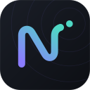

# NESSA brand identity

NESSA is an AI building partner from **Anharmonic Labs**: cloud reasoning when it is available,
your own machine when it is not.

## Mark

An **N drawn as one anharmonic waveform**. The stroke rises, swings through an asymmetric
oscillation and flicks upward, releasing a **signal point**: a resonance turned into action.
The desktop interface uses a monochrome teal variant that matches its controls.
The packaged application icons retain the original violet-to-cyan mark.

| File | Use |
|---|---|
| `nessa-icon.svg`, `icon-{32…512}.png` | App icon: mark on an ink tile with faint cymatic rings |
| `nessa-glyph.svg`, `glyph-{22,28,44,96}.png` | Mark alone, for UI headers and light or dark backgrounds |

Keep clear space of one dot-diameter around the mark. Use the interface accent for
the native vector variant; keep the dot and stroke together and avoid busy imagery.

## Wordmark

`nessa`, lower case, **Inter Display Bold**, set next to the glyph at about 0.7× the glyph height.
In running text write **Nessa**; NESSA is reserved for the project name.

## Colour

| Token | Hex | Role |
|---|---|---|
| Background | `#F7F7F3` | Warm light canvas |
| Panel | `#EEEFEA` | Sidebar |
| Surface | `#FFFFFF` | Cards, composer |
| Raised | `#E8EDE9` | Hover, user messages |
| Border | `#D8DFD8` | Hairlines |
| Text | `#263A33` | Primary text |
| Muted | `#596A62` | Secondary text |
| Faint | `#647167` | Hints, labels |
| Accent | `#35675A` | Primary actions, mark, active and ready state |
| Accent hover | `#294F45` | Active button surface |
| Selection | `#DDEAE3` | Selected text and history |
| Code | `#EDF2EE` | Code background |
| Warn | `#8A5C20` | Pending permission |
| Error | `#A23E3E` | Failures |

Use white text on filled accent and warning buttons. Reserve amber for a pending
decision; ordinary mode labels use muted text. Keep the rest of the interface in
one neutral family with a single accent.

## Type

- **Inter Display**: headings and the wordmark
- **Inter**: interface and conversation text
- **JetBrains Mono**: code, diffs, logs

## Voice

Direct, warm, specific. Say what Nessa is doing ("Reading game.py", "Running the tests check"),
never what it is "trying" to do. Report failures plainly. Short sentences; no hype.
