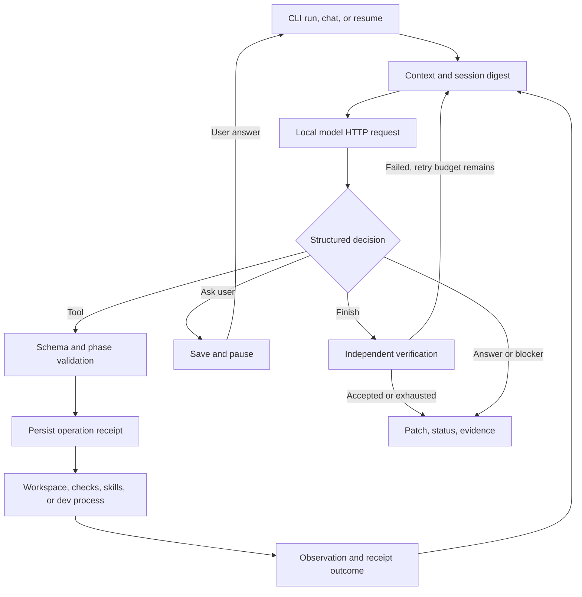

# NESSA message, tool, observation workflow

This is NESSA's own implementation of a model-driven feedback loop. It does not
reproduce or claim access to another product's private source or infrastructure.

## Implemented route

## Concrete implementation

| Responsibility | Implementation |
|---|---|
| User message and terminal chat | `agentharness/__main__.py`: `cmd_run`, `cmd_chat`, `cmd_resume` |
| Local backend HTTP and call normalization | `agentharness/llm.py`: `ChatClient.chat` |
| Offered tools and bounded context | `agentharness/agent.py`: `_ask`, `_system`, `_compact` |
| Argument validation | `agentharness/tools.py`: `Tool.validate` |
| Receipt before operation | `agentharness/agent.py`: `_execute`; `session.py`: `SessionStore` |
| Phase-limited execution | `agentharness/agent.py`: `_dispatch`, `_plan_round`, `_execute_phase` |
| Result returns to model | `agentharness/agent.py`: `_deliver` |
| Development process handle | `agentharness/dev.py`: named `start/status/logs/wait/stop` |
| Verification authority | `agentharness/agent.py`: `_after_edit`, `_finish_gate` |
| Durable snapshot and context digest | `agentharness/session.py`; `_save_session` |

Native mode preserves the assistant tool-call envelope and returns one matching
`tool_call_id` result for every call, including invalid or deferred calls. Text
mode offers typed JSON schemas in the prompt, parses tool objects, and feeds
observations back as explicitly marked tool-result messages. Calls in a turn run
sequentially; the default maximum is eight. A terminal decision defers later calls.

The model can call `respond(message)`, `ask_user(question)`, `blocked(reason)`, or
`finish(summary)`. `respond` cannot bypass final verification after file changes.
An answer to `ask_user` is an external conversation message, not a fabricated tool
result. Planning remains read-only until the normal plan-approval boundary.

## Evidence and restart

An evidence directory contains:

- `events.jsonl`: ordered model/tool/check/message events and model timings.
- `session.json`: atomic snapshot, configuration, phase, plan, messages, budgets,
  journal, user follow-ups, baseline checks, and serializable check commands.
- `context-digest.json`: current objective, instructions, plan, changed files,
  verification state, active skill names, latest observation and remaining steps.
- `operations/<uuid>.json`: arguments, call ID, kind, timestamps, full bounded-by-tool
  result and `pending`, `completed`, `failed`, or `outcome_unknown` status.
- `checkpoints/`, `patch.diff`, `result.json`, `messages.json`, `journal.json`.
- `dev/`: process logs and status manifest.

`resume WORK --message "answer"` reuses `WORK/repo` and `WORK/baseline`; it does not
copy the source again. It restores cumulative model steps and elapsed execution
time. Increasing either budget requires explicit `--extra-steps` or
`--extra-seconds`. It invalidates cached reads so edited files must be read again.

The same event log is appended on resume. Old events are not executed. A receipt
left pending by interruption becomes `outcome_unknown`; an identical operation
request is blocked for that resumed run. A command timeout is also uncertain:
process termination does not undo effects already performed. Inspect the workspace
and receipts before deciding how to recover. There is no exactly-once guarantee.

Snapshots use file flush, fsync and atomic replacement. This is process-level
recovery, not a transactional database spanning files, subprocesses and services.
Only one process may operate a given work directory at a time. Python callable
check implementations must be supplied again when resuming through the Python API;
missing custom checks in the CLI fail rather than silently disappearing.

## Context management

Serialized message characters plus native schema characters are bounded before
inference. This is an approximate token budget, not a tokenizer-exact guarantee.
Text-mode schemas describe only tools offered in the current phase.

Compaction inserts a deterministic state digest and retains recent whole exchanges.
It never leaves orphan tool-result messages, rewrites historical call arguments,
or deletes the full disk event history. Read deduplication is invalidated after
compaction so removed information can be fetched again. Oversized essential task
or instruction content causes an explicit error instead of silently losing it.

Backend context-overflow errors trigger one more aggressive compaction and retry.
Ordinary HTTP 400 schema/unsupported-tool errors are reported as model errors.

## Verification contract

The model proposes completion; the controller reruns checks. A check setup error,
timeout, or error cannot be masked by another passing check. Missing tests and
syntax-only results do not become `verified`. Changes remain a patch against the
original source until the user explicitly applies it.

Commands and registered checks that mutate the snapshot also produce edit checkpoints,
even when the command exits unsuccessfully. Table extraction that can write output is
classified as an edit and is not offered during read-only planning.

Managed processes expose `dev_wait(name, seconds)` with a ten-second maximum wait.
A pending process is not a passed test. Status/log reads are live, never cached as
duplicate file reads. Log tails read at most 12 KB into memory. Process logs on
disk are not rotated; operators should keep dev sessions bounded.

## Capability boundary

| Capability | State in this update |
|---|---|
| Terminal conversation and durable follow-ups | Implemented |
| Local model native/text tools and schema validation | Implemented |
| Repository reading/editing, patches and verification | Implemented and preserved |
| Persistent instructions, skills and advisory reviewer | Existing layers retained |
| Receipts, context digest, resume, unknown-outcome handling | Implemented |
| Managed asynchronous process polling | Implemented; process handles are names |
| JavaScript execution cells | Not implemented; Python controller owns orchestration |
| Arbitrary interactive stdin/PTY sessions | Not implemented |
| Reattaching dev processes after parent restart | Not implemented; inspect surviving OS processes manually |
| MCP, browser automation, external app/media connectors | Not implemented in this change; no fictitious tools advertised |
| Autonomous worker swarm | Not added; repository contract requires one parent loop |
| OpenTelemetry exporter and graphical chat UI | Not implemented; JSON events and terminal chat are available |
| Training or modifying model weights | Not performed |

`--no-shell` disables generic command and dev-process launch tools. Registered
checks still execute trusted project commands. A private copy protects the original
from ordinary workspace edits; it is not an OS sandbox for malicious commands.
